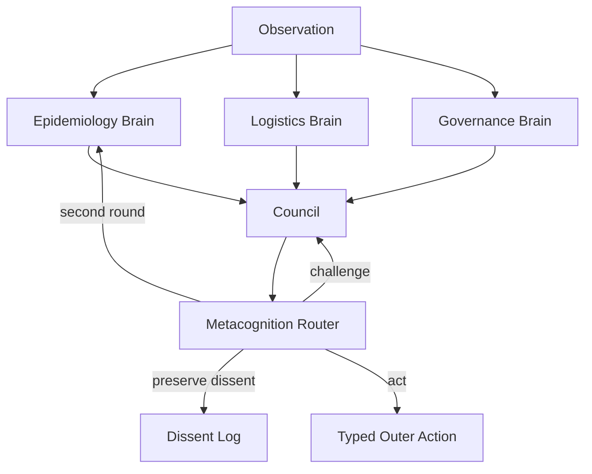

# CrisisWorldCortex: Teaching Agents to Govern Their Own Thinking

The failure mode that started this project was not that language models make
mistakes. That is obvious. The more interesting failure is that they can make
the same kind of mistake together.

Ask one model for several answers and the samples often orbit the same
attractor. Ask several models to debate and they can still converge toward a
comfortable shared prior. Give them a judge and the judge can flatten the
remaining disagreement into a single polished answer. On open-ended tasks,
where the useful signal is often held in minority hypotheses, edge cases, and
unpopular interpretations, this looks less like collective intelligence and
more like artificial hivemind.

That phrase became the north star for CrisisWorldCortex.

We did not want to build another benchmark where an agent gets a prompt, emits
an action, and receives a scalar reward. We wanted to build an environment that
asks a deeper question:

> Can an AI system govern its own thinking before it governs the world?

This is the story of how we turned that question into an OpenEnv environment.

## The Problem: Agreement Is Not Intelligence

The easiest way to make an AI system look thoughtful is to ask it to generate
more text. The easiest way to make it look social is to add more agents. But
neither step guarantees better reasoning.

If every agent sees the same flattened observation, shares the same base model,
uses similar prompts, and is finally compressed by one central judge, the
system can become a theater of disagreement. It says different things for a few
turns, then collapses into the same answer it probably would have produced
alone.

That is not the kind of multi-agent intelligence we wanted to measure.

Real institutions do not work well because there are many people in the room.
They work when the room has structure. A good crisis team has epidemiologists,
logistics leads, legal authorities, field operators, dissent channels, escalation
rules, budget constraints, and deadlines. The value is not just plurality. The
value is governed plurality.

So our starting claim was deliberately narrow:

> The interesting unit of learning is not only the final action. It is the
> internal governance policy that decides which thoughts are worth paying for.

That is where Cortex comes in.

## Cortex: Metacognition as the Controller

Cortex is our inner cognitive system. It is not just "a bunch of agents." It is
a nested society with roles, phases, hard caps, and a controller that decides
how cognition gets spent.

At the lowest level, Cortex has subagents:

- Perception, which deterministically extracts salient signals.
- World Modeler, which forms hypotheses about hidden state.
- Planner, which proposes candidate interventions.
- Critic, which attacks assumptions and looks for failure modes.
- Brain Executive, which turns internal evidence into a recommendation.

Those subagents are arranged into domain brains: Epidemiology, Logistics, and
Governance. Each brain sees the same world, but through a different lens.
Epidemiology cares about spread and delayed case signals. Logistics cares about
resource scarcity and deployment tradeoffs. Governance cares about legal
constraints, compliance, and the cost of authority.

The brains feed a Council. The Council does not simply average their opinions.
It runs a small epistemic protocol:

1. Let each brain form an independent first view.
2. Require evidence citations instead of pure preference.
3. Challenge overconfident or conflicting recommendations.
4. Preserve dissent when a minority view could matter later.
5. Converge when the world needs an action.

The central learned object is the metacognitive router: the policy that decides
whether to call another subagent, request a challenge, preserve dissent, spend
another round, or stop and act.

This matters because recursive thought is not free. More reasoning can help,
but it can also burn budget, delay action, and amplify the same prior. Cortex
therefore treats thinking as an intervention with a cost.



This is our answer to artificial hivemind: not "make agents disagree," but
make disagreement operational. Make it typed. Make it budgeted. Make it
measurable. Make the system learn when disagreement is useful and when it is
just noise.

## Why We Needed CrisisWorld

Once we had the cognition story, we needed a world that could actually test it.

A toy environment would not work. If the correct action is obvious from the
observation, then metacognition has nothing to do. If the reward arrives only
at the end, the training signal becomes too weak. If actions are free text, the
grader becomes fragile. If the world has no hidden state, then a council of
specialists is mostly decoration.

So we built CrisisWorld: a regional outbreak-control simulator for OpenEnv.

CrisisWorld is not a game board with arbitrary points. It is a deliberately
messy control setting:

- The true outbreak state is latent.
- Reported case counts are delayed and noisy.
- Hospital load is current but incomplete.
- Compliance is only a proxy.
- Resources are scarce and typed.
- Strict restrictions may be illegal until authority is escalated.
- Hard scenarios include cross-region cascade and hidden superspreader events.

The agent has six MVP actions:

- `deploy_resource`
- `request_data`
- `restrict_movement`
- `escalate`
- `reallocate_budget`
- `no_op`

Every action is typed. Every rejected action is recorded. The environment keeps
state. The observation never leaks latent SEIR variables. The agent has to
infer, decide, and live with the consequences.

This gives Cortex a reason to exist. Epidemiology may see a delayed case spike.
Logistics may know that the needed resource is almost gone. Governance may know
that the best restriction is currently blocked. A flat agent can blur those
concerns into one answer. Cortex keeps them separate long enough for the
metacognitive layer to decide what should be challenged, preserved, or acted
on.

## The Reward Signal Is the Product

For this project, reward design was not an afterthought. It is part of the
research claim.

Many environments technically return a reward, but the signal is too sparse,
too constant, or too easy to game. We wanted a reward that could support real
training and real ablations. The environment reward, `r_outer`, is dense and
decomposed:

```text
r_outer =
  infection control
+ time pressure
+ hospital pressure
+ cascade control
+ policy validity
+ fairness
```

The policy-validity component is intentionally strong. A real accepted
intervention gets positive signal. A legal but passive `no_op` is allowed but
not rewarded as useful action. A rejected action is penalized. A parse-failure
marker can terminate the episode.

That gives the learner a sharp surface:

- Doing nothing should not look as good as acting well.
- Illegal or V2-only actions should not silently pass.
- Parse failures should become visible in the reward.
- Active, valid intervention should separate from passive behavior.

We locked this into tests. All-no-op episodes must stay below a threshold.
All-rejected episodes must stay below a threshold. Active strategic deployment
must score higher. The active-vs-no-op separation must remain large enough to
train against.

Then we added the second layer: training reward can subtract a token-budget
penalty. That means the router is not simply rewarded for thinking forever. It
has to learn the price of another call.

Finally, we keep evaluation metrics separate from training reward:

- Collapse rate: did the policy fall into repeating the same action?
- Dissent value: did preserved minority views later prove useful?
- Consensus calibration: did confidence track realized reward?
- Novelty yield: did a second round actually change the decision?

That separation is important. We do not want to directly reward theatrical
disagreement. We want to measure whether the system resists collapse when it
matters.

## Matched Compute, or the Claim Does Not Count

There is an easy way to make a multi-agent system win: spend more tokens.

We did not want that loophole.

CrisisWorldCortex includes baselines designed around the central control
question:

- B1 is a flat agent: one LLM call per tick.
- B2 is a matched-compute self-revision agent: generate, critique, revise, and
  repeat until the same per-tick budget is nearly used.
- B3 is Cortex with a deterministic router: the full architecture without a
  learned metacognitive policy.

This lets us ask cleaner questions:

- Does extra compute alone help?
- Does structured cognition help before learning?
- Does a learned router improve how the same cognitive machinery is used?

That last question is the heart of the project. The router is small, but its
job is powerful. It decides where attention goes. It decides whether a
minority view deserves preservation. It decides whether urgency beats another
round of thought. It decides whether the council has earned the right to act.

In other words, the router learns governance of thought.

## A Tick in the Life of Cortex

Imagine the hard scenario.

The outbreak is spreading across five regions. The case reports are delayed by
three ticks. A hidden superspreader event has already changed the latent state,
but the observation does not say that directly. Resources are scarce. Strict
movement restriction is blocked until national escalation.

A flat agent sees a table of numbers and may jump to the obvious move: restrict
the region with the highest reported cases. But those cases are old. The
current hospital load tells a more urgent story. The best restriction may be
illegal. The scarce resource might be better held for a coming cascade.

Cortex starts differently.

The Epidemiology brain flags the delayed signal and estimates where the
infection may actually be now. The Logistics brain checks whether test kits,
hospital beds, mobile units, and vaccines can support the intervention. The
Governance brain notices that a strict restriction may be blocked and that
escalation has a cost.

The Council sees disagreement. Metacognition now has a choice.

It can force convergence and act immediately. It can ask the most uncertain
brain to challenge the most confident one. It can preserve a dissenting
recommendation for later evaluation. It can spend a second round. Or it can
stop and emit a conservative action if the budget is running out.

That is the moment we care about. Not the final JSON alone, but the decision
about whether more thinking is worth it.

## Why OpenEnv Was the Right Surface

OpenEnv gave us a clean way to make this environment real instead of purely
conceptual.

CrisisWorldCortex has:

- A typed `Action` schema.
- A typed `Observation` schema.
- A FastAPI/WebSocket environment server.
- Docker and Hugging Face Spaces deployment paths.
- A validator-facing `inference.py`.
- Baselines that use the same wire protocol as Cortex.
- Unit tests around simulator determinism, reward quality, legal constraints,
  schema round trips, and import boundaries.

The point is not just to write a paper-shaped idea. The point is to make a
benchmark that can be reset, stepped, deployed, trained against, and inspected.

The `/web` interface gives the standard OpenEnv surface. The `/cortex`
dashboard gives us a more visual place to tell the council story. The same
environment can serve flat baselines, matched-compute baselines, deterministic
Cortex, and later learned-router Cortex.

## What We Are Claiming

We are not claiming that multi-agent systems always beat single agents.

We are not claiming that debate is magic.

We are not claiming that our MVP solves every crisis-control problem.

The claim is narrower and, we think, stronger:

> CrisisWorldCortex is an OpenEnv benchmark where cognition is organized as a
> nested, budgeted, typed system; where disagreement-handling is part of the
> decision process; and where the environment can reward external control while
> measuring internal collapse.

That combination is the novelty.

The environment is the measurement surface. Cortex is the candidate cognitive
architecture. Metacognition is the trainable controller. The artificial
hivemind is the failure mode we are trying to expose and resist.

## The Bigger Picture

The long-term direction is not just better outbreak control. CrisisWorld is a
proxy for a class of tasks where decisions are high-stakes, evidence is
partial, and the best answer depends on keeping several institutional
perspectives alive long enough to make a better choice.

Emergency response has this shape. Cyber defense has this shape. Supply-chain
triage has this shape. Scientific review has this shape. Any domain where
premature consensus is dangerous has this shape.

As models become stronger, the question shifts. It is no longer enough to ask
whether a model can produce a plausible answer. We need to ask whether a system
can notice when its own reasoning is collapsing, when another perspective is
worth consulting, when dissent is signal, and when action can no longer wait.

CrisisWorldCortex is our attempt to make that question executable.

Not just:

> What should the agent do?

But:

> How should the agent decide how to think before it acts?

That is the research bet. If we can train that layer, we get something more
interesting than a longer prompt or a louder debate. We get an agent that has a
governance policy for its own cognition.

And in a crisis world, that may be the difference between fast agreement and
good judgment.

# Results
